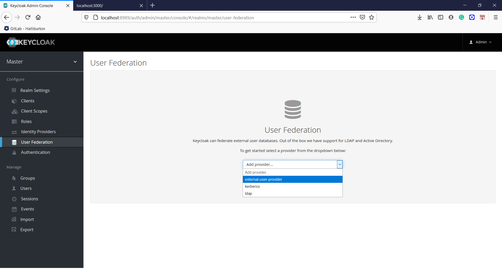
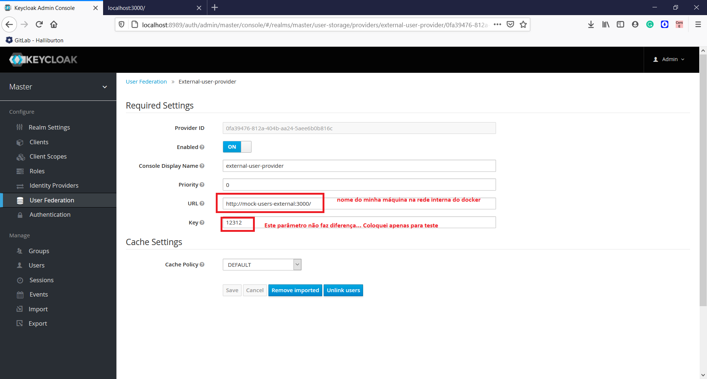
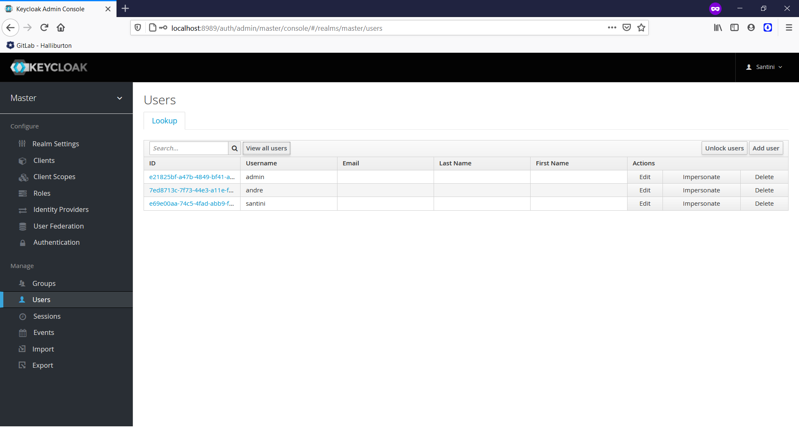
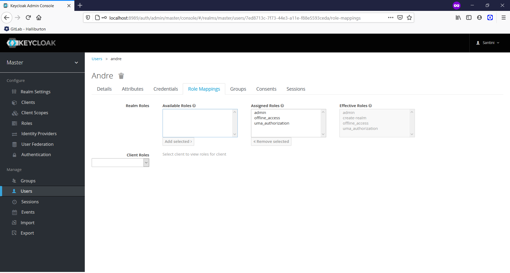

# Service Provider Interfaces (SPI)
São interfaces que possibilitam extender/incrementar funcionalidades do Keycloak

# API Mock User (pasta mock-user-node-api)
É uma api em express (nodejs) para servir de autenticador externo.
Existem apenas 3 usuários que ficam armazenados em uma lista em memória (somente pra exemplo). São eles (username/password)
- andre/andre
- emanoel/emanoel
- santini/santini

# External User SPI (pasta external-user-spi)
Projeto JAVA que implementa uma User Storage Provider para permitir que o Keycloak se autentique com o nossa api externa.

# Compilando
Abra o projeto external-user-spi e o compile para gerar o JAR. Copie o JAR para a pasta deployments, essa pasta é um volume no docker que aponta justamente pra pasta deployments do keycloak. Qualquer JAR nessa pasta será deployado no server e sua funcionalidade será incorporada no keycloak. Esse é o poder das SPI!

# Executando o projeto
1. Existe um docker compose na pasta root do projeto, para executá-lo abra um prompt de comando e navegue para a pasta deste arquivo.
2. Execute o comando: docker-compose up --build -d
3. Acesse http://localhost:3000 para verificar ser a API de autenticação externa está funcionando
4. Acesse http://localhost:8989 para verificar se o keycloak está rodando
5. Faça login no keycloak com o usuário admin/admin
6. No menu lateral do keycloak acesse "User Federation"
7. Adicione o provider "external-user-provider"

8. Abra uma guia anônima no seu browser e acesse o keycloak (http://localhost:8989)
9. Faça login com algum dos usuários existentes na API Mock user
10. É possível ver que o usuário foi "integrado" no keycloak (veja o menu Users do keycloak)

Obs: Para parar o docker basta executar "docker-compose down" no prompt

# Pontos importantes do código
- A classe "ExternalUserStorageProviderFactory" é responsável pelo nome que aparecerá na tela do User Federation
- A classe "ExternalUserStorageProvider" é a principal, toda a lógica de autenticação é feita nela. Veja o método "isValid" ele que valida o usuário na API EXTERNA
- Nesse exemplo sempre que o usuário é validado na API EXTERNA e está correto eu adiciono no LocalStorage do Keycloak com a ROLE ADMIN! Veja o método "isValid" e "addToStorage"
- Caso queira adicionar alguma nova role ao usuário no momento em que ele for inserido no keycloak basta alterar o método "addToStorage"
- A classes responsáveis pela chamada REST a nossa API Mock User são "ExternalUserProviderClient" e "ExternalUserProviderService"

#Implantando em Produção
Para implantar em produção basta pegar o JAR gerado no seu projeto e adicionar na pasta deployments da instalação do seu keycloak. Essa pasta varia de acordo com sua instalação. Por exemplo, o keycloak instalado em ambientes linux a pasta é "/opt/jboss/keycloak/standalone/deployments/"

#Quer aprender mais coisas do que eu? Estude os links... 
- https://www.keycloak.org/docs/4.8/server_development/index.html
- https://github.com/thomasdarimont/keycloak-extension-playground
- https://www.programcreek.com/java-api-examples/?api=org.keycloak.authentication.AuthenticationFlowContext

#Dúvidas?
andredemattos.ferraz@hallibuton.com
